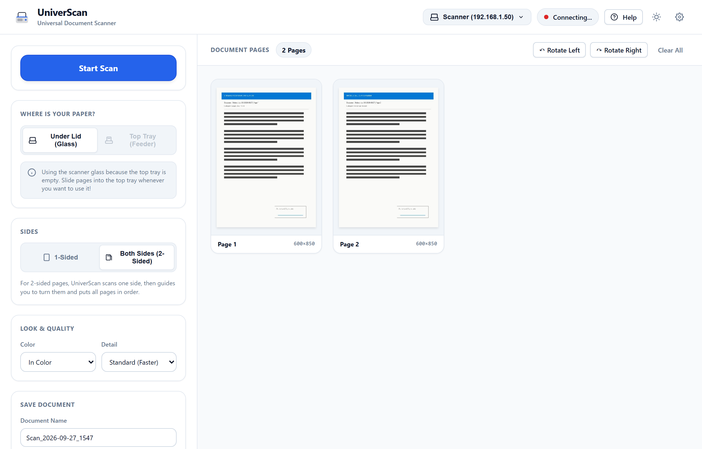
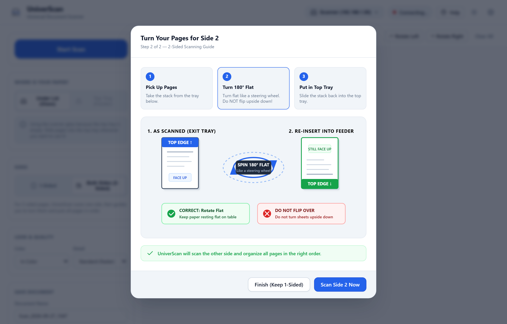
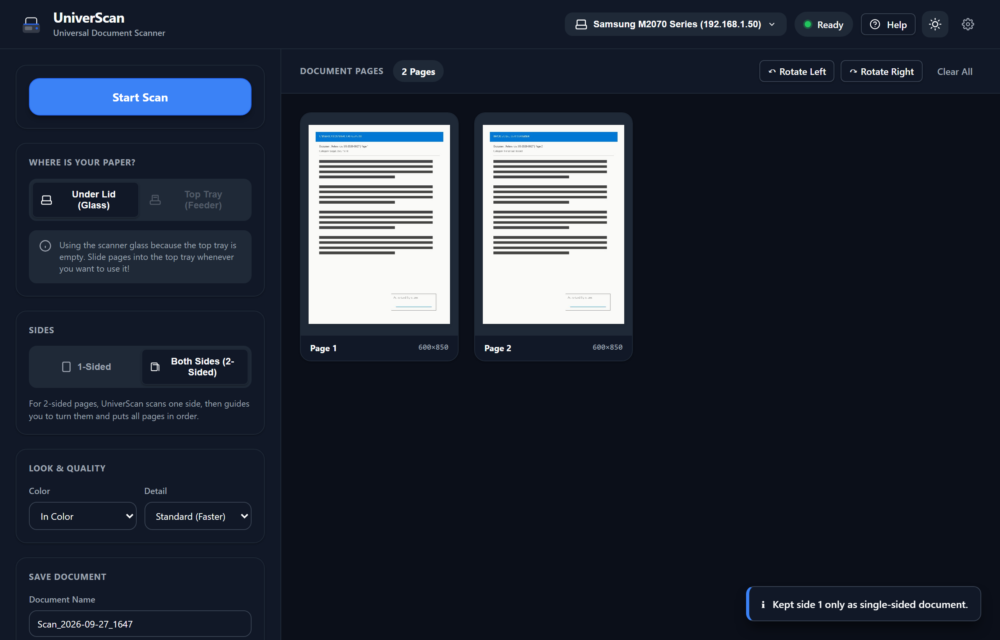

# UniverScan 📄✨

  

    The Simple, Universal Document Scanner for Everyone
  

  

    One sober, driverless application that works with almost any network scanner in the world. Designed for kids doing homework, busy parents, and grandparents alike.
  

  

    <a href="https://github.com/arnaudbletterer/universcan/releases/latest/download/UniverScan-Setup.exe" style="display: inline-flex; align-items: center; gap: 8px; background-color: #0078D4; color: white; padding: 12px 22px; border-radius: 8px; font-weight: 700; text-decoration: none; font-size: 15px; box-shadow: 0 2px 6px rgba(0,120,212,0.3);">
      
      Download for Windows
    </a>
    <a href="https://github.com/arnaudbletterer/universcan/releases/latest/download/UniverScan-macOS.pkg" style="display: inline-flex; align-items: center; gap: 8px; background-color: #111111; color: white; padding: 12px 22px; border-radius: 8px; font-weight: 700; text-decoration: none; font-size: 15px; box-shadow: 0 2px 6px rgba(0,0,0,0.3);">
      
      Download for macOS (.pkg)
    </a>
    <a href="https://github.com/arnaudbletterer/universcan/releases/latest" style="display: inline-flex; align-items: center; gap: 8px; background-color: #F3F4F6; color: #1F2937; border: 1px solid #D1D5DB; padding: 12px 20px; border-radius: 8px; font-weight: 700; text-decoration: none; font-size: 15px;">
      
      Linux & Other Downloads →
    </a>
  

---

  

---

## 3 Simple Steps to Scan

Scanning shouldn't require reading a 50-page manual or choosing between 20 different technical options.

  

    
📄

    <h3 style="margin-top: 0; font-size: 1.15rem;">1. Put Paper In</h3>
    
Place your stack in the top feeder tray, or put a single page on the glass under the lid.

  

  

    
🔘

    <h3 style="margin-top: 0; font-size: 1.15rem;">2. Click "Start Scan"</h3>
    
The scanner wakes up, starts scanning immediately, and pages appear live on your screen.

  

  

    
💾

    <h3 style="margin-top: 0; font-size: 1.15rem;">3. Click "Save as PDF"</h3>
    
Your document is saved neatly into your personal <code>Documents/Scans</code> folder with the date and time.

  

---

## What Makes UniverScan Unique

### 🔄 Guided 2-Sided Scanning
Most home scanners only have a 1-sided feeder. UniverScan solves this with our signature **Steering Wheel Guide**: scan side 1, spin the stack 180° flat like a steering wheel, and scan side 2. UniverScan automatically reorders every page (**1, 2, 3, 4, 5...**) without any manual sorting!

  

### 💡 1-Click Problem Solver & Help
If your scanner isn't responding, you don't need to know anything about IP addresses or ports. Simply click **Help** > **⚡ Test Scanner Connection** > **📋 Copy Help Information**. You can paste the report directly to someone helping you or to an AI assistant to fix the issue in seconds.

  

### 🌙 Thoughtful Light & Dark Modes
Designed with Swiss typography principles and Apple Human Interface Guidelines. Clean, legible, high-contrast, and easy on the eyes day or night.

  

---

## Universal Compatibility

UniverScan connects directly over your home Wi-Fi or local network without requiring manufacturer CDs or drivers:

| Brand | Compatibility Mode |
| :--- | :--- |
| **Samsung & Xerox** | Raw Port 9400 TCP protocol + WSD |
| **HP (Hewlett-Packard)** | AirScan (eSCL) & WSD Scan |
| **Canon & Epson** | Driverless eSCL / AirScan / Mopria |
| **Brother & Lexmark** | WS-Scan (WSD) & eSCL |
| **Kyocera, Ricoh, OKI** | Universal Web Services for Devices (WSD) |

---

## Ready to Scan?

- 📖 [Getting Started Guide](getting-started.md)
- 📄 [Step-by-Step Scanning Instructions](how-to-scan.md)
- 🔄 [2-Sided Scanning Walkthrough](two-sided-guide.md)
- 🛠️ [Hardware Compatibility Details](supported-scanners.md)
- 💡 [Problem Solver & FAQs](troubleshooting.md)
- 💻 [Source Code on GitHub](https://github.com/arnaudbletterer/universcan)
