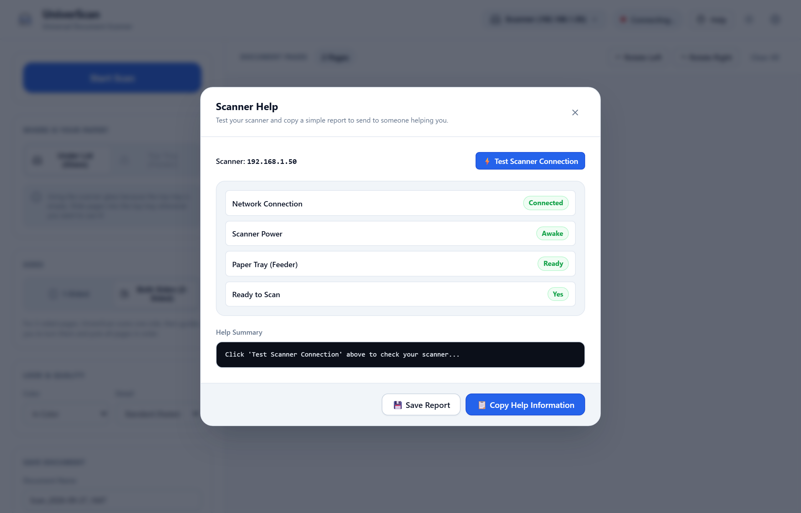

# Problem Solver & Help 💡

We want scanning to be completely stress-free. If something isn't working as expected, here are quick, simple solutions.

---

## 1. The Scanner Says "Sleeping" 💤

Scanners enter power-saving sleep mode after a few minutes of inactivity to save electricity.

- **Solution:** Click the yellow **⚡ Wake Up Scanner** button in UniverScan.
- Alternatively, walk over to your scanner and press any physical button (such as the *Power*, *Cancel*, or *Menu* button) to wake it up. Once the small screen lights up, UniverScan will say **Ready**.

---

## 2. "Looking for Scanner..." or Scanner Not Found 🔍

If UniverScan cannot find your scanner on the network:

1. **Check the power:** Make sure your scanner is turned on and plugged into the wall.
2. **Check Wi-Fi:** Ensure your computer and your scanner are connected to the same home Wi-Fi network (or router).
3. **Enter the Address Directly:**
   - Look at your scanner's screen for its IP address (looks like `192.168.1.50`).
   - In UniverScan, click on the scanner name at the top.
   - Enter your scanner's address and click **Connect**.

---

## 3. Top Feeder Says "Empty" But Paper Is There 📄

- Make sure the sheets are pushed gently all the way into the feeder slot until they rest against the rollers. Many scanners make a short chime when they detect the paper.
- If you only have one page, simply place it on the glass under the lid and select **Under Lid (Glass)**.

---

## 4. How to Get Help (1-Click Report) 📋

If you ever run into a problem you can't solve on your own, UniverScan has a built-in helper:

1. Click the **Help** button in the top right corner of the app.
2. Click **⚡ Test Scanner Connection**. UniverScan will test the connection in 2 seconds.
3. Click **📋 Copy Help Information**.
4. That's it! Now you can paste (`Ctrl + V` on Windows/Linux or `Cmd + V` on Mac) into an email, message, or GitHub issue to send to a friend, technician, or AI assistant.

The report includes everything needed to understand the problem immediately, without you having to know any technical details.
