# 2-Sided (Duplex) Scanning Guide 🔄

Most home and small-office scanners have an automatic top feeder that only scans one side of the paper at a time. 

With UniverScan, you can easily scan double-sided documents without buying an expensive commercial scanner!

---

## How It Works in 2 Simple Passes

When you select **Both Sides (2-Sided)** in UniverScan:

1. **Pass 1:** UniverScan scans all the front sides of your stack (Pages 1, 3, 5, etc.).
2. **The Turn:** UniverScan pauses and shows you a friendly picture explaining how to turn the paper.
3. **Pass 2:** UniverScan scans the back sides and automatically interleaves every page so your final PDF is in perfect order: **Page 1, Page 2, Page 3, Page 4, Page 5...**

---

## The Secret: Turn Flat Like a Steering Wheel 🚗

  

This is the most important step:

> 🛑 **DO NOT flip the paper stack over like a pancake!**  
> If you flip it over, the top and bottom of the pages get reversed.

### How to Turn the Stack:

1. **Pick up the stack:**  
   Take the whole stack of paper out of the exit tray where it just came out.
2. **Turn it 180° Flat:**  
   Keep the pages facing up. Turn the stack flat on the table, just like turning a car steering wheel or spinning a plate half a circle.
3. **Put it back into the top tray:**  
   Slide the stack right back into the top feeder slot.
4. **Click "Scan Side 2 Now":**  
   UniverScan scans the back of the stack, puts all pages in the right sequence, and displays them on your screen!

---

## What if You Change Your Mind?

If you only meant to scan 1 side, simply click **Finish (Keep 1-Sided)** on the prompt screen. UniverScan will keep the pages you already scanned and let you save your PDF immediately.
